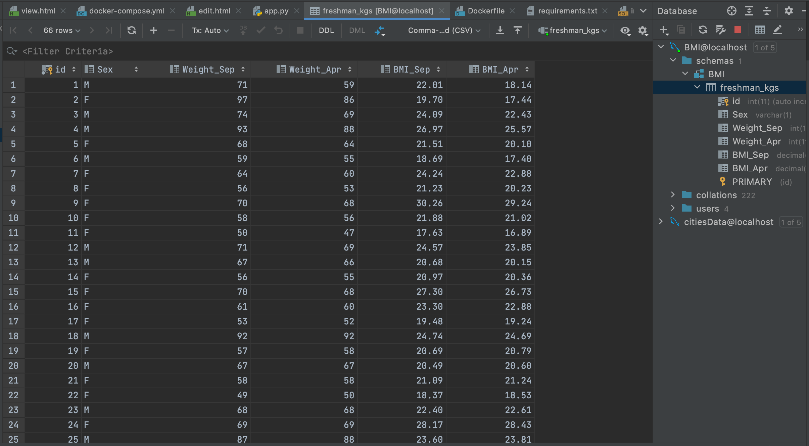

# Web Application Part 3
# Project Description
This project is a homework assignment to teach how to get pycharm setup with Docker, Flash, MySQL

# Data table in pycharm Screenshot

# Webpage Screenshot

# data record as a view of one record Screenshot

# data record as a view of new record Screenshot

# data record as a view of updated record Screenshot

# data record as a view of deleted record Screenshot

